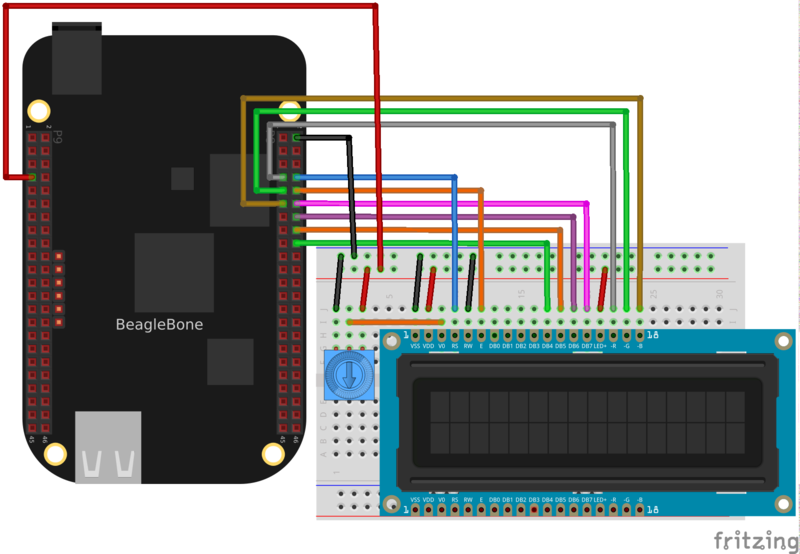
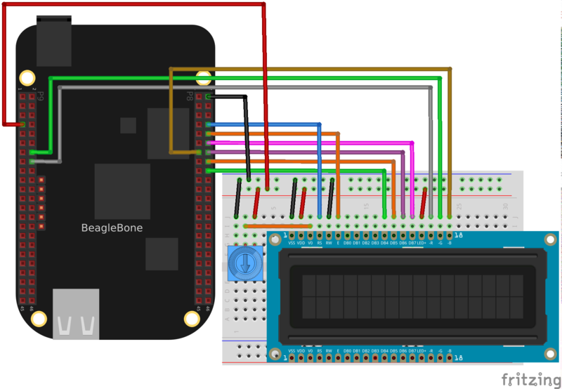

BeagleBone Black
Wire your BeagleBone Black to the LCD as follows. If you aren't familiar with how to
identify pins on the board, be sure to read the BeagleBone Black GPIO guide. 

    *Connect BeagleBone Black 5V power pin P9_7 to the power rail of the breadboard. From
    the power rail connect one outer lead of the potentiometer, LCD pin 2 (VDD), and LCD
    pin 15 (LED+).
    *Connect BeagleBone Black ground pin P8_2 to the ground rail of the breadboard. From
    the ground rail connect the other outer lead of the potentiometer, LCD pin 1 (VSS),
    and LCD pin 5 (R/W).
    
    *Connect the middle lead of the potentiometer to LCD pin 3 (V0/contrast).
*Connect BeagleBone Black pin P8_8 to LCD pin 4 (RS).
*Connect BeagleBone Black pin P8_10 to LCD pin 6 (E/clock enable).
*Connect BeagleBone Black pin P8_18 to LCD pin 11 (DB4).
*Connect BeagleBone Black pin P8_16 to LCD pin 12 (DB5).
*Connect BeagleBone Black pin P8_14 to LCD pin 13 (DB6).
*Connect BeagleBone Black pin P8_12 to LCD pin 14 (DB7).
*Connect BeagleBone Black pin P8_7 to LCD pin 16 (-R/red).
*Connect BeagleBone Black pin P8_9 to LCD pin 17 (-G/green).
*Connect BeagleBone Black pin P8_11 to LCD pin 18 (-B/blue).

BeagleBone Black with PWM
The above wiring will use digital IO to control the colors of the backlight display. This means the backlight can only show 7 different colors (all the combinations of the 3 backlight LEDs). However because the BeagleBone Black supports PWM (pulse-width modulation) control of some hardware pins, it's possible to use PWM pins to control the backlight LEDs and display a range of almost all colors.

To use PWM control of the backlight LEDs, wire your BeagleBone Black to the LCD as follows. Note that this wiring is exactly the same as the non-PWM wiring, except the 3 backlight LED pins (red, green, blue) are moved to different pins. 

*Connect BeagleBone Black 5V power pin P9_7 to the power rail of the breadboard. From
    the power rail connect one outer lead of the potentiometer, LCD pin 2 (VDD), and LCD
    pin 15 (LED+).
*Connect BeagleBone Black ground pin P8_2 to the ground rail of the breadboard. From
    the ground rail connect the other outer lead of the potentiometer, LCD pin 1 (VSS),
    and LCD pin 5 (R/W).
*Connect the middle lead of the potentiometer to LCD pin 3 (V0/contrast).
*Connect BeagleBone Black pin P8_8 to LCD pin 4 (RS).
*Connect BeagleBone Black pin P8_10 to LCD pin 6 (E/clock enable).
*Connect BeagleBone Black pin P8_18 to LCD pin 11 (DB4).
*Connect BeagleBone Black pin P8_16 to LCD pin 12 (DB5).
*Connect BeagleBone Black pin P8_14 to LCD pin 13 (DB6).
*Connect BeagleBone Black pin P8_12 to LCD pin 14 (DB7).
*Connect BeagleBone Black pin P9_16 to LCD pin 16 (-R/red).
*Connect BeagleBone Black pin P9_14 to LCD pin 17 (-G/green).
*Connect BeagleBone Black pin P8_13 to LCD pin 18 (-B/blue).

BeagleBone Black
On the BeagleBone Black execute the following commands in a terminal/SSH session on the
device:
Download: file

    sudo apt-get update
    sudo apt-get install build-essential python-dev python-smbus python-pip git
    sudo pip install Adafruit_BBIO

You can ignore any warnings about dependencies already being installed.
Installation
Once the dependencies above have been installed you can install the character LCD module
by executing the following commands on the device:
Download: file

    cd ~
    git clone https://github.com/adafruit/Adafruit_Python_CharLCD.git
    cd Adafruit_Python_CharLCD
    sudo python setup.py install

These commands will clone the GitHub repository with the library source and then execute
the setup.py script to install the library.
